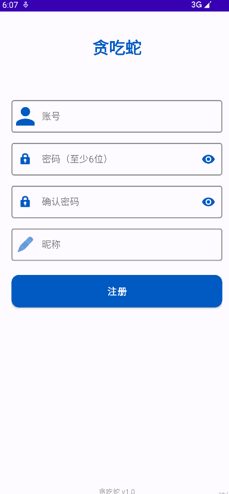
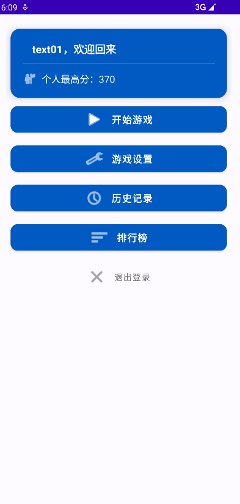
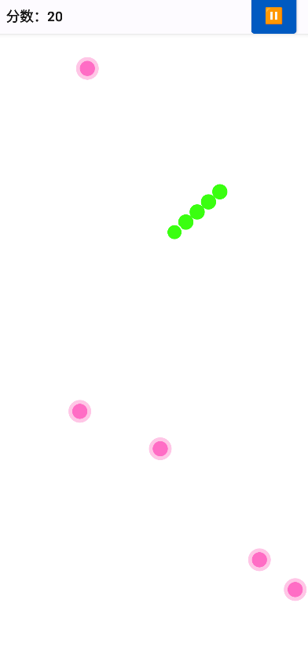
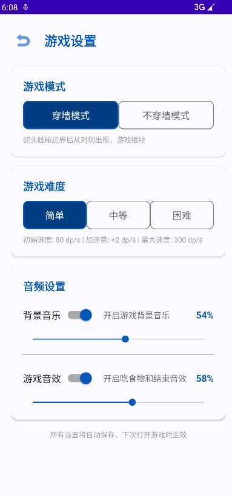
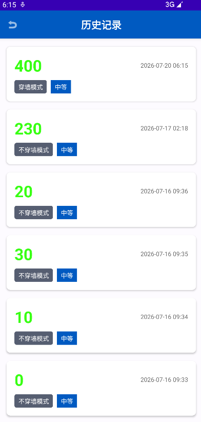
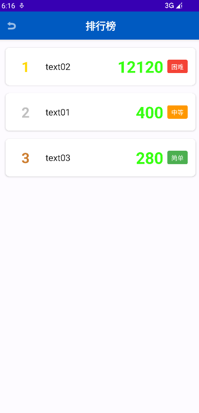
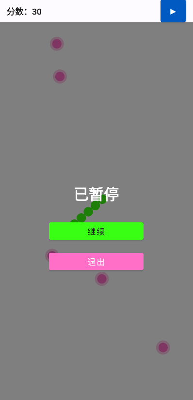
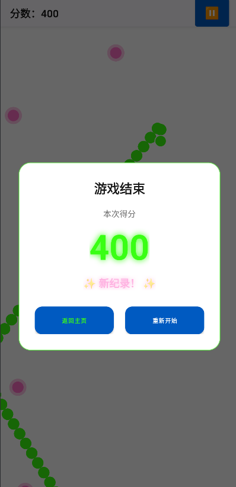

# 🐍 贪吃蛇 (Snake)

一款基于 **Android** 平台开发的单机版贪吃蛇游戏，采用现代扁平化霓虹视觉风格，支持本地多用户注册登录、多种游戏模式与难度、完整的本地数据统计及多媒体控制功能。

---

## 📱 项目截图

> **以下截图展示了游戏的核心界面，实际效果以运行为准。**

| 登录页 | 注册页 | 主页 |
|:---:|:---:|:---:|
|  |  |  |

| 游戏页 | 设置页 | 历史记录 |
|:---:|:---:|:---:|
|  |  |  |

| 排行榜 | 暂停弹窗 | 结算弹窗 |
|:---:|:---:|:---:|
|  |  |  |


---

## ✨ 功能特性

### 🎮 游戏核心
- **像素级平滑移动**：蛇以像素级精度做连续平滑移动，不做网格跳跃，帧率稳定 ≥ 60fps
- **双模式切换**：穿墙模式 / 不穿墙模式，自由组合
- **三档难度**：简单 / 中等 / 困难，动态速度递增机制
- **全屏手势操控**：滑动手势控制蛇头方向，灵敏度可调
- **方向防逆**：禁止蛇头 180° 反向移动

### 👤 用户系统
- **本地多用户**：支持账号注册、登录、自动登录
- **密码安全**：MD5 加密存储
- **登出管理**：一键清除登录态

### 📊 数据统计
- **个人历史记录**：按时间倒序展示全部游戏记录
- **个人最高分**：主页实时展示，结算时判断是否刷新纪录
- **全用户排行榜**：本机所有注册用户的历史最高分排行

### 🎵 多媒体控制
- **背景音乐 (BGM)**：`MediaPlayer` 循环播放，支持开关与音量调节
- **游戏音效 (SFX)**：`SoundPool` 低延迟播放吃食物音效
- **设置持久化**：所有音频设置应用重启后保持不变

### ⚙️ 游戏设置
- 模式选择（穿墙 / 不穿墙）
- 难度选择（简单 / 中等 / 困难）
- 背景音乐开关 & 音量 (0%~100%)
- 游戏音效开关 & 音量 (0%~100%)
- 所有设置即时生效并持久化

---

## 🏗️ 技术架构

```
┌─────────────────────────────────────────┐
│              UI 层 (Activity + XML)      │
│   登录页 · 注册页 · 主页 · 游戏页 · 设置页  │
│   历史记录 · 排行榜 · 结算弹窗 · 暂停遮罩   │
├─────────────────────────────────────────┤
│           逻辑层 (SurfaceView + 子线程)    │
│   GameEngine · Snake · Food · Direction   │
│   GameSurfaceView · GestureHelper       │
├─────────────────────────────────────────┤
│              数据层                       │
│   Room Database (SQLite) · SharedPreferences│
│   User · GameRecord · DAO · Repository    │
├─────────────────────────────────────────┤
│            多媒体层                       │
│   MediaPlayer (BGM) · SoundPool (SFX)    │
└─────────────────────────────────────────┘
```

### 技术栈
| 层级 | 技术方案 |
|:---:|:---|
| **UI 层** | Activity + XML Layout |
| **游戏渲染** | 自定义 `SurfaceView` + 子线程游戏循环 |
| **数据持久化** | Room (SQLite) + SharedPreferences |
| **多媒体** | MediaPlayer (BGM) + SoundPool (SFX) |
| **交互方式** | 全屏滑动手势 |
| **编程语言** | Java |
| **最低 SDK** | API 24 (Android 7.0) |
| **目标 SDK** | API 34 (Android 14) |

---

## 📁 项目结构

```
Snake/
├── app/
│   ├── build.gradle                    ← 模块级依赖配置
│   └── src/
│       ├── main/
│       │   ├── AndroidManifest.xml
│       │   ├── java/com/example/snake/
│       │   │   ├── App.java                       ← Application 入口
│       │   │   ├── data/
│       │   │   │   ├── db/
│       │   │   │   │   ├── AppDatabase.java         ← Room 数据库单例
│       │   │   │   │   ├── entity/
│       │   │   │   │   │   ├── User.java            ← 用户实体
│       │   │   │   │   │   ├── GameRecord.java      ← 游戏记录实体
│       │   │   │   │   │   ├── UserScoreDTO.java    ← 排行榜 DTO
│       │   │   │   │   │   └── MaxScoreDTO.java     ← 最高分 DTO
│       │   │   │   │   └── dao/
│       │   │   │   │       ├── UserDao.java         ← 用户 DAO
│       │   │   │   │       └── GameRecordDao.java   ← 记录 DAO
│       │   │   │   ├── repository/
│       │   │   │   │   ├── UserRepository.java      ← 用户仓库
│       │   │   │   │   └── GameRecordRepository.java ← 记录仓库
│       │   │   │   └── prefs/
│       │   │   │       └── PrefsManager.java        ← SharedPreferences 封装
│       │   │   ├── engine/
│       │   │   │   ├── Direction.java               ← 方向枚举
│       │   │   │   ├── GameConfig.java                ← 游戏配置
│       │   │   │   ├── GameEngine.java                ← 核心引擎
│       │   │   │   ├── GameEventListener.java         ← 事件回调
│       │   │   │   ├── Snake.java                     ← 蛇状态管理
│       │   │   │   ├── Food.java                      ← 食物逻辑
│       │   │   │   └── SnakeNode.java                 ← 蛇身节点
│       │   │   ├── audio/
│       │   │   │   └── GameAudioManager.java          ← 音频管理单例
│       │   │   ├── ui/
│       │   │   │   ├── login/
│       │   │   │   │   ├── LoginActivity.java         ← 登录页
│       │   │   │   │   └── RegisterActivity.java      ← 注册页
│       │   │   │   ├── home/
│       │   │   │   │   └── HomeActivity.java          ← 主页
│       │   │   │   ├── settings/
│       │   │   │   │   └── SettingsActivity.java      ← 设置页
│       │   │   │   ├── game/
│       │   │   │   │   ├── GameActivity.java          ← 游戏页
│       │   │   │   │   ├── GameOverDialog.java        ← 结算弹窗
│       │   │   │   │   └── PauseOverlayView.java      ← 暂停遮罩
│       │   │   │   ├── history/
│       │   │   │   │   ├── HistoryActivity.java       ← 历史记录页
│       │   │   │   │   └── HistoryAdapter.java        ← 历史记录适配器
│       │   │   │   └── leaderboard/
│       │   │   │       ├── LeaderboardActivity.java   ← 排行榜页
│       │   │   │       └── LeaderboardAdapter.java    ← 排行榜适配器
│       │   │   ├── widget/
│       │   │   │   └── GameSurfaceView.java           ← 游戏渲染 SurfaceView
│       │   │   └── util/
│       │   │       ├── Constants.java                 ← 全局常量
│       │   │       ├── MD5Util.java                     ← MD5 加密工具
│       │   │       └── DpPxUtil.java                    ← dp/px 转换工具
│       │   └── res/
│       │       ├── layout/              ← 全部布局文件
│       │       ├── values/              ← colors · strings · dimens · themes
│       │       ├── drawable/            ← 霓虹风图标、背景 shape
│       │       └── raw/
│       │           ├── bgm_game.mp3     ← 背景音乐（需自行放置）
│       │           └── sfx_eat.mp3      ← 吃食物音效（需自行放置）
│       └── androidTest/                 ← Room 插桩测试（可选）
├── build.gradle                         ← 项目级构建配置
├── settings.gradle
└── gradle.properties
```

---

## 🚀 快速开始

### 环境要求
- **Android Studio**: Hedgehog (2023.1.1) 或更高版本
- **JDK**: 17 或更高版本
- **Android SDK**: API 24 ~ API 34
- **Gradle**: 8.2+

### 构建步骤

```bash
# 1. 克隆仓库
git clone https://github.com/ZoomWyze/snake-android.git
cd snake-android

# 2. 用 Android Studio 打开项目
   File → Open → 选择项目根目录

# 3. 同步 Gradle
   点击 "Sync Project with Gradle Files" 按钮

# 4. 准备音频资源（重要！）
    将以下音频文件放入 app/src/main/res/raw/ 目录：
   - bgm_game.mp3   (背景音乐，建议 1~2 分钟循环)
    - sfx_eat.mp3    (吃食物短音效，建议 < 1 秒)

# 5. 构建并运行
   连接设备或启动模拟器 → 点击 Run ▶
```

### 首次运行
1. 打开应用 → 进入 **注册页** 创建账号
2. 注册成功后自动跳转 **登录页**
3. 登录后进入 **主页**，可查看个人最高分
4. 点击 **"开始游戏"** 进入游戏
5. 在游戏区域滑动手指控制蛇的移动方向

---

## 🎮 游戏玩法

| 操作 | 说明 |
|:---|:---|
| **滑动屏幕** | 控制蛇头移动方向（任意角度） |
| **暂停按钮** | 点击顶部信息栏暂停按钮，弹出暂停菜单 |
| **吃食物** | 蛇头触碰食物 → 得分 +10，蛇身增长 |
| **穿墙模式** | 蛇头触碰边界从对侧出现 |
| **不穿墙模式** | 蛇头触碰边界 → 游戏结束 |
| **自碰撞** | 蛇头触碰自身 → 游戏结束 |

### 难度参数

| 难度 | 初始速度 | 单次加速 | 最大速度 |
|:---:|:---:|:---:|:---:|
| 简单 | 80 dp/s | +2 dp/s | 300 dp/s |
| 中等 | 100 dp/s | +3 dp/s | 400 dp/s |
| 困难 | 120 dp/s | +4 dp/s | 500 dp/s |

---

## 🗄️ 数据库设计

### users 表

| 字段 | 类型 | 约束 | 说明 |
|:---:|:---:|:---:|:---|
| `id` | INTEGER | PK, AUTOINCREMENT | 用户唯一 ID |
| `username` | TEXT | UNIQUE, NOT NULL | 登录账号 |
| `password_hash` | TEXT | NOT NULL | MD5 加密密码 |
| `nickname` | TEXT | NOT NULL | 用户昵称 |
| `created_at` | INTEGER | NOT NULL | 注册时间戳 |

### game_records 表

| 字段 | 类型 | 约束 | 说明 |
|:---:|:---:|:---:|:---|
| `id` | INTEGER | PK, AUTOINCREMENT | 记录唯一 ID |
| `user_id` | INTEGER | FK → users.id | 关联用户 |
| `score` | INTEGER | NOT NULL | 本局得分 |
| `mode` | TEXT | NOT NULL | `wall_pass` / `no_wall_pass` |
| `difficulty` | TEXT | NOT NULL | `easy` / `medium` / `hard` |
| `played_at` | INTEGER | NOT NULL | 游戏时间戳 |

---

## 📋 开发阶段

本项目采用 **分阶段迭代开发** 模式，共 12 个阶段：

| 阶段 | 内容 | 产出 |
|:---:|:---|:---|
| 0 | 项目脚手架 | build.gradle, Manifest, themes, colors |
| 1 | 数据层 | Entity, DAO, Database, Repository, PrefsManager |
| 2 | 工具类 | Constants, MD5Util, DpPxUtil |
| 3 | 注册登录 | LoginActivity, RegisterActivity |
| 4 | 主页框架 | HomeActivity（欢迎语、最高分、导航按钮） |
| 5 | 游戏设置 | SettingsActivity（模式/难度/音频设置） |
| 6 | 游戏引擎 | Direction, Snake, Food, GameEngine（纯 Java） |
| 7 | 游戏页 UI | GameActivity, GameSurfaceView, GestureHelper |
| 8 | 结算弹窗 | GameOverDialog, 数据记录写入 |
| 9 | 暂停/生命周期 | PauseOverlayView, 自动暂停恢复 |
| 10 | 多媒体 | GameAudioManager (BGM + SFX) |
| 11 | 历史记录 | HistoryActivity, HistoryAdapter |
| 12 | 排行榜 | LeaderboardActivity, LeaderboardAdapter |

---

## 🛡️ 非功能性需求

| 编号 | 需求 | 说明 |
|:---:|:---|:---|
| 1 | **性能** | 像素级移动流畅无卡顿，速度递增过程帧率稳定 ≥ 60fps |
| 2 | **适配** | 适配主流 Android 全面屏机型，竖屏锁定 |
| 3 | **生命周期** | 应用退后台自动暂停并保存状态；返回前台可恢复 |
| 4 | **音频持久化** | BGM/SFX 开关与音量设置应用重启后保持不变 |
| 5 | **方向防逆** | 任何时刻禁止蛇头 180° 反向移动 |

---

## 📦 依赖清单

```gradle
dependencies {
    // AndroidX
    implementation 'androidx.appcompat:appcompat:1.6.1'
    implementation 'com.google.android.material:material:1.11.0'
    implementation 'androidx.constraintlayout:constraintlayout:2.1.4'

    // Room
    implementation 'androidx.room:room-runtime:2.6.1'
    annotationProcessor 'androidx.room:room-compiler:2.6.1'

    // Lifecycle
    implementation 'androidx.lifecycle:lifecycle-livedata:2.7.0'
}
```

---

## 🤝 贡献指南

欢迎提交 Issue 和 Pull Request！

1. Fork 本仓库
2. 创建特性分支：`git checkout -b feature/xxx`
3. 提交更改：`git commit -m 'Add xxx'`
4. 推送分支：`git push origin feature/xxx`
5. 创建 Pull Request

---

## 📄 开源协议

本项目基于 [MIT License](LICENSE) 开源。

---

## 🙏 致谢

- [Android Open Source Project](https://source.android.com/)
- [Material Design](https://m3.material.io/)
- [Room Persistence Library](https://developer.android.com/training/data-storage/room)

---

> 🎮 **Enjoy the game!** 如有问题，欢迎提交 Issue 讨论。
